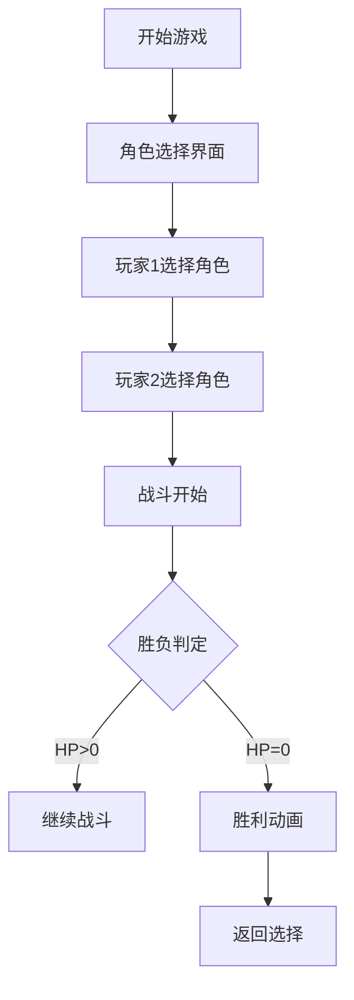

# 办公室格斗大会 - 产品需求文档

## 1. 产品概述

一款充满创意的2D横版格斗游戏，以办公室职场为背景，玩家可以选择各种职位角色进行1v1对战。每个角色拥有独特的职业技能和必杀技，融合了职场元素与街机格斗的爽快感。

**核心亮点：**
- 6位特色鲜明的办公室角色
- 每个人物拥有3个专属技能 + 1个终极必杀技
- 复古像素风格与现代流畅操作结合
- 本地双人对战模式

---

## 2. 核心功能

### 2.1 角色系统

| 角色 | 职位 | 特性 | 风格 |
|------|------|------|------|
| 小明 | 程序员 | 键盘侠本色，生命值中等，攻速快 | 科技感 |
| Emily | HR | 擅长"谈话"，远程消耗能力强 | 温柔但致命 |
| 张总 | 老板 | 高生命高伤害，移动慢 | 权力气息 |
| 小红 | 财务 | 精准打击，暴击率高 | 精明干练 |
| 阿杰 | 销售 | 连击技能多，机动性高 | 激情洋溢 |
| 美美 | 行政 | 防御技能强，回复能力 | 后勤专家 |

### 2.2 技能系统

每个角色拥有：
- **普通攻击**：快速拳击/踢腿，消耗能量最少
- **技能1**：职业技能，消耗中等能量
- **技能2**：职业技能，消耗较高能量
- **终极技能**：强力必杀技，消耗全部能量槽

### 2.3 战斗机制

- **生命值 (HP)**：100点，被攻击时减少
- **能量值 (MP)**：100点，使用技能消耗，缓慢自动回复
- **暴击**：特定技能可触发暴击，造成双倍伤害
- **防御**：按住防御键减少50%伤害
- **击飞**：部分技能可将敌人击飞

### 2.4 游戏模式

- **角色选择**：展示6位角色及其技能说明
- **战斗场景**：办公室背景的格斗舞台
- **胜利判定**：HP归零方失败

---

## 3. 核心流程

---

## 4. 用户界面设计

### 4.1 设计风格

- **整体风格**：复古像素风格 + 霓虹灯效果
- **主色调**：深色背景 (#0f0f23) + 霓虹色彩点缀
- **字体**：像素风格字体 (Press Start 2P)
- **动效**：角色移动流畅，攻击有打击感，特效华丽

### 4.2 页面设计

| 页面 | 模块 | UI元素 |
|------|------|--------|
| 标题页 | 游戏标题 + 开始按钮 | 霓虹发光效果，脉冲动画 |
| 角色选择 | 6角色展示 + 技能预览 | 角色立绘，悬停显示详情 |
| 战斗界面 | HP/MP血条 + 角色 + 技能提示 | 底部操作提示，顶部状态栏 |
| 胜利界面 | 获胜角色 + 再次挑战 | 庆祝动画 |

### 4.3 控制方案

**玩家1 (左侧)：**
- A/D：左右移动
- W：跳跃
- J：普通攻击
- K：技能1
- L：技能2
- I：终极技能

**玩家2 (右侧)：**
- ←/→：左右移动
- ↑：跳跃
- 1：普通攻击
- 2：技能1
- 3：技能2
- 0：终极技能

---

## 5. 角色技能详细设计

### 5.1 小明 (程序员)
- **HP**: 100 | **MP**: 100 | **攻速**: 快 | **移动**: 中
- 普通攻击：键盘敲击 - 快速连打
- 技能1「代码注入」：发射键盘弹幕 (远程消耗)
- 技能2「死机冲击」：冲刺撞击
- 终极技「系统崩溃」：全屏代码雨攻击

### 5.2 Emily (HR)
- **HP**: 90 | **MP**: 110 | **攻速**: 中 | **移动**: 快
- 普通攻击：文件夹拍打
- 技能1「绩效谈话」：远程声波攻击
- 技能2「团队优化」：生成护盾
- 终极技「裁员风暴」：文件如雨点般落下

### 5.3 张总 (老板)
- **HP**: 130 | **MP**: 80 | **攻速**: 慢 | **移动**: 慢
- 普通攻击：威严拍桌
- 技能1「会议室召唤」：瞬移到敌人身后
- 技能2「加薪诱惑」：减少敌人攻击力
- 终极技「明天不用来了」：一巴掌拍飞

### 5.4 小红 (财务)
- **HP**: 95 | **MP**: 100 | **攻速**: 中 | **移动**: 中
- 普通攻击：计算器戳击
- 技能1「精确预算」：高暴击率一击
- 技能2「报销单据」：投掷文件造成持续伤害
- 终极技「财务审计」：计算机全屏闪光

### 5.5 阿杰 (销售)
- **HP**: 100 | **MP**: 100 | **攻速**: 快 | **移动**: 快
- 普通攻击：名片飞射
- 技能1「热情推销」：连续踢腿
- 技能2「客户关系」：短暂无敌
- 终极技「签单时刻」：合同龙卷风

### 5.6 美美 (行政)
- **HP**: 110 | **MP**: 90 | **攻速**: 慢 | **移动**: 中
- 普通攻击：文具盒拍击
- 技能1「会议室预定」：创建障碍物
- 技能2「下午茶时间」：回复自身HP
- 终极技「组织团建」： picnic blanket 全屏AOE

---

## 6. 技术实现

- **前端框架**：React + TypeScript + Vite
- **样式方案**：TailwindCSS + CSS动画
- **状态管理**：Zustand
- **音效**：Web Audio API (可选)
- **游戏循环**：requestAnimationFrame
