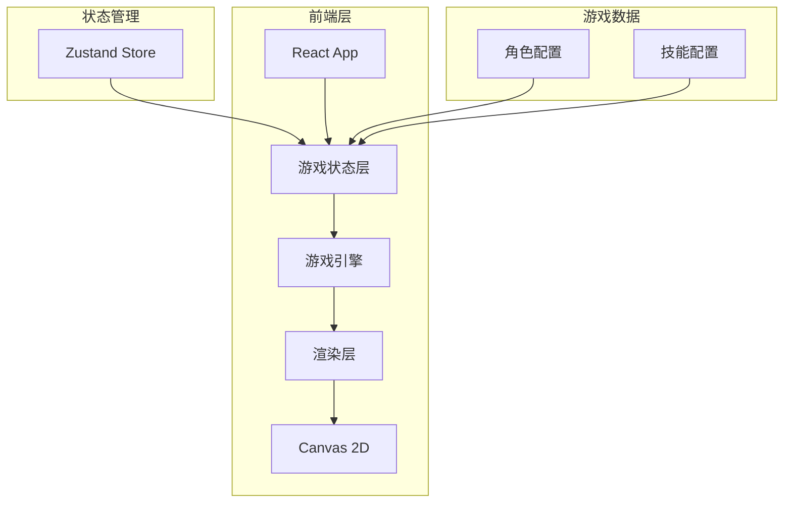

# 办公室格斗大会 - 技术架构文档

## 1. 架构设计



## 2. 技术选型

| 技术 | 用途 |
|------|------|
| React@18 | UI框架 |
| TypeScript | 类型安全 |
| Vite | 构建工具 |
| TailwindCSS | 样式方案 |
| Zustand | 状态管理 |
| Canvas 2D | 游戏渲染 |

## 3. 项目结构

```
src/
├── components/         # React组件
│   ├── TitleScreen.tsx    # 标题画面
│   ├── CharacterSelect.tsx # 角色选择
│   ├── BattleArena.tsx    # 战斗场景
│   └── VictoryScreen.tsx  # 胜利画面
├── game/               # 游戏核心逻辑
│   ├── engine.ts          # 游戏引擎
│   ├── fighter.ts         # 角色类
│   ├── skills.ts          # 技能系统
│   ├── collision.ts       # 碰撞检测
│   └── constants.ts       # 常量配置
├── store/              # Zustand状态
│   └── gameStore.ts       # 游戏状态
├── data/               # 静态数据
│   └── characters.ts      # 角色数据
├── App.tsx
└── main.tsx
```

## 4. 核心模块

### 4.1 游戏引擎 (engine.ts)
- 游戏主循环 (60fps)
- 状态管理 (title/select/battle/victory)
- 帧更新调度

### 4.2 角色类 (fighter.ts)
```
Fighter {
  x, y: number           # 位置
  hp, maxHp: number       # 生命值
  mp, maxMp: number       # 能量值
  speed: number           # 移动速度
  attackPower: number     # 攻击力
  state: FighterState     # 当前状态
  skills: Skill[]         # 技能列表
  
  move(direction)         # 移动
  attack()                # 攻击
  useSkill(index)         # 使用技能
  takeDamage(amount)      # 受到伤害
}
```

### 4.3 技能系统 (skills.ts)
- 技能定义：名称、伤害、能耗、动画、特效
- 碰撞区域计算
- 技能效果应用

## 5. 游戏状态

```typescript
interface GameState {
  screen: 'title' | 'select' | 'battle' | 'victory'
  player1: Fighter | null
  player2: Fighter | null
  winner: number | null
  frameCount: number
}
```

## 6. 关键算法

### 6.1 碰撞检测
- AABB (轴对齐边界框) 检测
- 攻击判定框与受击判定框交集

### 6.2 技能连段
- 记录当前连段数
- 段时间窗口内累计伤害
- 视觉反馈增强

## 7. 渲染流程

1. 清除画布
2. 绘制背景
3. 绘制角色精灵
4. 绘制技能特效
5. 绘制UI (HP/MP条)
6. 绘制伤害数字
