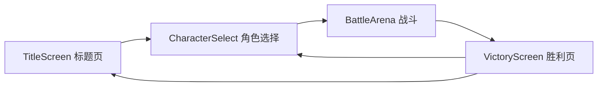
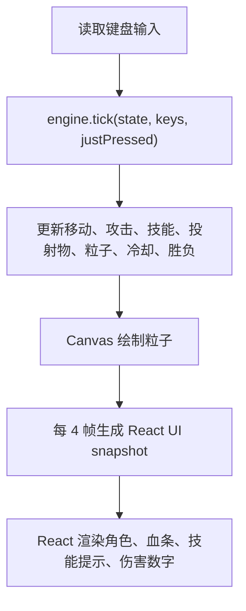
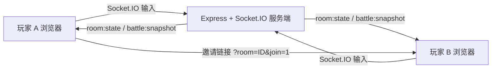
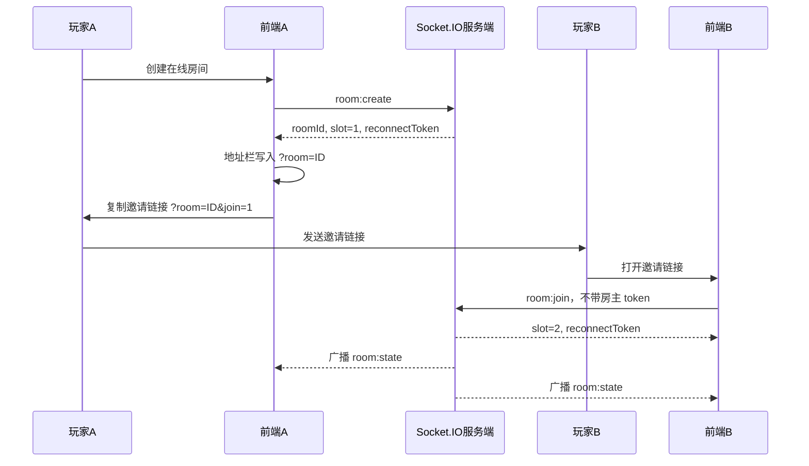
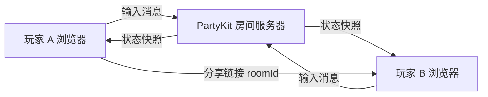
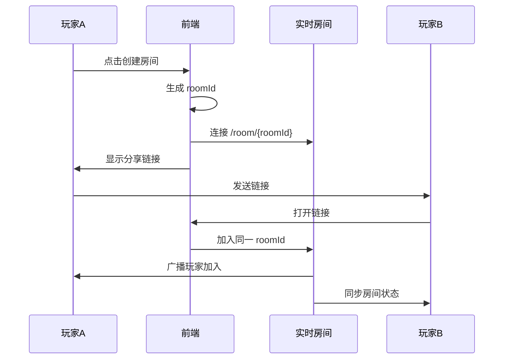

# 办公室格斗小游戏产品与技术文档

更新时间：2026-06-14

## 1. 项目结论

这是一个基于 React + TypeScript + Vite 的单页前端小游戏，核心玩法是本地双人键盘对战。当前项目已经补充 Socket.IO 在线对战 MVP：前端在 `D:\allproject\minigame`，后端在 `D:\allproject\backendMinigame`。

如果要实现“通过链接分享给别人，并与别人在线对战”，必须新增实时通信层。推荐路线是：

1. 短期验证：接入 Playroom Kit，最快做出可分享房间链接和双人在线体验。
2. 正式可控版本：接入 PartyKit 或 Socket.IO，自己管理房间、输入同步、断线重连和对战状态。
3. 游戏化长期版本：接入 Colyseus，把战斗房间、权威状态、匹配、房间生命周期交给游戏服务器框架。

对当前项目来说，最稳的工程落地方案是“前端继续渲染和收集输入，服务端负责权威 tick，同步输入或状态快照”。不要只把本地 Zustand 状态互相广播出去，那样会很容易出现双方画面不一致、作弊和延迟抖动问题。

当前已落地决策：

- 实时通信：Socket.IO。
- 后端框架：Express + Node HTTP server + TypeScript。
- 房间模型：单房间 2 人，服务端分配 player 1 / player 2。
- 战斗同步：客户端上报输入，服务端 60Hz tick，20Hz snapshot。
- 分享链接：房主地址使用 `?room=<roomId>`，邀请链接使用 `?room=<roomId>&join=1`。
- 身份恢复：`reconnectToken` 存在 `sessionStorage`，避免同一设备两个浏览器互相抢身份。
- 防串位：后端禁止用 token 覆盖仍在线的原玩家 socket。

## 2. 产品梳理

### 2.1 产品定位

产品名可暂定为“办公室格斗大会 / Office Fighting Championship”。

核心体验：

- 选择办公室职业角色。
- 使用普通攻击、技能、终极技能进行 1v1 对战。
- 本地双人键盘同屏对战。
- 后续扩展为链接邀请好友在线对战。

目标用户：

- 轻量娱乐小游戏用户。
- 适合内部团建、社群传播、朋友圈链接挑战。
- 可作为 Web 小游戏 MVP，后续扩展排行榜、分享战绩、角色成长。

### 2.2 当前已实现功能

- 标题页。
- 角色选择页。
- 本地双人战斗页。
- 胜利页。
- 多角色配置。
- HP、MP、技能、冷却、普通攻击、位移、跳跃、格挡、连击、投射物、粒子、震屏、胜负判定。
- 在线大厅。
- 创建房间、加入房间、复制邀请链接。
- 在线角色选择和 ready 状态同步。
- 服务端权威在线战斗快照。
- 断线后基于 `sessionStorage` 的短时重连。

### 2.3 当前玩法结构

玩家 1：

- 移动：W/A/S/D 中实际使用 W/A/D。
- 普攻：J。
- 技能：K、L。
- 终极技能：I。

玩家 2：

- 移动：方向键。
- 普攻：1。
- 技能：2、3。
- 终极技能：0。

### 2.4 当前产品问题

1. 文案和角色数据存在明显乱码。
   - 多个文件中的中文和 emoji 被错误编码保存或转码。
   - 影响界面可读性，也会影响后续国际化和分享传播。

2. 在线对战仍是 MVP。
   - 已支持远程玩家、房间、邀请链接和基础断线恢复。
   - 暂不支持旁观、匹配、排行榜、战绩持久化和移动端虚拟按键。

3. 游戏逻辑和渲染耦合较高。
   - `BattleArena.tsx` 负责输入、循环、渲染和部分流程控制。
   - `engine.ts` 负责战斗 tick，但内部有随机数和 `setTimeout` 副作用。
   - 联网前需要先抽出可复现、可同步的战斗核心。

4. 状态系统有两套痕迹。
   - `src/store/gameStore.ts` 是 Zustand 全局状态。
   - `src/game/GameState.ts` 是战斗使用的可变单例状态。
   - 当前战斗主要依赖 `GameState` 和 `engine.tick`，Zustand 更多承担页面状态和角色选择。

## 3. 技术架构

### 3.1 技术栈

- 构建工具：Vite 6。
- UI 框架：React 18。
- 语言：TypeScript。
- 状态管理：Zustand。
- 样式：全局 CSS + 组件内 inline style + Tailwind 配置存在但当前使用较少。
- 图形：DOM + Canvas 混合渲染。
- 包管理：npm，项目有 `package-lock.json`。

### 3.2 目录结构

```text
.
├─ index.html
├─ package.json
├─ vite.config.ts
├─ tsconfig.json
├─ src
│  ├─ main.tsx
│  ├─ App.tsx
│  ├─ index.css
│  ├─ components
│  │  ├─ TitleScreen.tsx
│  │  ├─ CharacterSelect.tsx
│  │  ├─ BattleArena.tsx
│  │  └─ VictoryScreen.tsx
│  ├─ data
│  │  └─ characters.ts
│  ├─ game
│  │  ├─ GameState.ts
│  │  ├─ constants.ts
│  │  └─ engine.ts
│  └─ store
│     └─ gameStore.ts
└─ public
   └─ favicon.svg
```

### 3.3 启动方式

```bash
npm install
npm run dev
```

默认访问：

```text
http://127.0.0.1:5173/
```

构建检查：

```bash
npm run check
npm run build
```

### 3.4 页面流转



### 3.5 当前战斗主循环

`BattleArena.tsx` 中维护：

- `keysRef`：当前按住的键。
- `justPressedRef`：本帧刚按下的键。
- `stateRef`：指向 `gameState` 单例。
- `requestAnimationFrame`：驱动循环。

每帧流程：



### 3.6 核心状态

`GameState`：

- `p1` / `p2`：双方战斗状态。
- `projectiles`：投射物。
- `particles`：粒子。
- `damageTexts`：伤害飘字。
- `skillPopups`：技能提示。
- `screenShake`：震屏。
- `frameCount`：帧计数。
- `winner` / `winnerTimer`：胜负状态。

`FighterState`：

- 角色配置。
- 坐标、朝向、跳跃速度。
- HP、MP。
- 攻击帧、技能帧、冷却。
- 格挡、护盾、眩晕、受击闪烁。
- 连击和连击计时。

## 4. 联机对战需求拆解

### 4.1 用户体验目标

最小可用版本：

1. 玩家 A 点击“创建房间”。
2. 系统生成房间号和分享链接。
3. 玩家 A 把链接发给玩家 B。
4. 玩家 B 打开链接进入同一个房间。
5. 双方选择角色。
6. 房主或系统开始战斗。
7. 双方分别控制自己的角色。
8. 战斗结束后显示胜负。

分享链接示例：

```text
https://your-game.example.com/?room=ABCD12
https://your-game.example.com/room/ABCD12
```

### 4.2 非功能需求

- 延迟：理想 50ms 内，休闲可接受 100ms 到 150ms。
- 对局人数：1v1，房间最大 2 人，后续可加旁观。
- 重连：短线 10 到 30 秒内可恢复。
- 同步频率：输入同步 20 到 60Hz，状态快照 10 到 20Hz。
- 防作弊：MVP 可弱防护，正式版应服务器权威。
- 兼容性：移动端需要后续增加触控按钮，目前主要是桌面键盘。

### 4.3 联机模式选择

#### 模式 A：状态广播

每个客户端本地跑游戏，然后把自己的位置、血量、技能状态广播给对方。

优点：

- 改动最小。
- 最快看到“在线”效果。

缺点：

- 双方状态容易分叉。
- 很难处理碰撞、伤害、胜负争议。
- 容易作弊。

不推荐作为正式方案，只适合 Demo。

#### 模式 B：输入同步

双方只发送输入，所有客户端用同一个初始状态和同一套 tick 逻辑模拟。

优点：

- 带宽低。
- 格斗游戏常用思路之一。

缺点：

- 当前代码有 `Math.random()`、`setTimeout()`、浏览器帧率差异，暂时不够确定性。
- 一旦某一帧不同步，后续全局状态都会分叉。
- 需要 lockstep、rollback 或定期校验。

适合中长期优化，但当前需要先重构引擎确定性。

#### 模式 C：服务器权威

客户端只发送输入，服务器维护唯一权威 GameState，按固定 tick 计算战斗，再广播状态快照给双方。

优点：

- 一致性最好。
- 作弊风险低。
- 断线、重连、裁判逻辑更清晰。

缺点：

- 需要后端或实时服务。
- 要把当前 `GameState + engine.tick` 移到可在 Node/边缘运行时执行的模块。

推荐作为正式落地方案。

#### 模式 D：房主权威

玩家 A 作为 host，本地维护权威状态，玩家 B 发送输入给 A，A 广播状态。

优点：

- 可以不自建强后端，适合 P2P。
- 比纯状态广播更一致。

缺点：

- 房主可作弊。
- 房主断线对局结束。
- NAT、WebRTC 信令和连接质量会带来额外复杂度。

适合实验或熟人局。

## 5. 成熟外部包和平台选型

### 5.1 Playroom Kit

官方文档：

- https://docs.joinplayroom.com/
- https://docs.joinplayroom.com/multiplayer
- https://docs.joinplayroom.com/features/games/lobby
- https://docs.joinplayroom.com/features/games/matchmaking

官方定位是无需自建后端的多人体验工具，提供房间、共享状态、参与者、房间码、匹配等能力。文档中提到可通过 `insertCoin()` 进入多人房间，也可以使用 `getRoomCode` 和 `roomCode` 参数组成自己的链接加入流程。

适合本项目：

- 最快做出“复制链接邀请好友”。
- 适合休闲小游戏。
- 可减少后端部署成本。

风险：

- 对实时格斗这种高频、强一致玩法，需要验证延迟和同步策略。
- 如果要完全控制裁判、反作弊、回放、排行榜，后续可能还是要迁移到自有后端或 Colyseus。

建议用法：

- MVP 使用 Playroom 做房间和玩家状态。
- 客户端先做房主权威或轻量输入同步。
- 链接格式使用 `?room=<roomCode>`。

安装示例：

```bash
npm install playroomkit
```

### 5.2 PartyKit

官方文档：

- https://docs.partykit.io/
- https://docs.partykit.io/guides/
- https://docs.partykit.io/reference/partysocket-api/
- https://docs.partykit.io/how-partykit-works/

PartyKit 是基于 WebSocket 房间模型的实时服务。官方文档说明每个房间可以通过 URL 中的 id 创建独立连接，也提供 `partysocket` 客户端自动重连。

适合本项目：

- 很适合“一个链接对应一个房间”。
- 前端项目可以保留，新增 `party/server.ts` 管理房间。
- 部署轻量，适合 1v1 小游戏。

风险：

- 需要自己写房间协议、输入队列、tick、状态广播。
- 如果战斗逻辑很复杂，后端运行时限制需要提前验证。

推荐程度：高。适合当前项目从前端单机升级为在线 1v1。

初始化示例：

```bash
npx partykit@latest init
npm install partysocket
```

房间连接示例：

```ts
import PartySocket from "partysocket";

const socket = new PartySocket({
  host: import.meta.env.VITE_PARTYKIT_HOST,
  room: roomId,
});
```

### 5.3 Colyseus

官方文档：

- https://docs.colyseus.io/
- https://docs.colyseus.io/room
- https://docs.colyseus.io/matchmaker
- https://docs.colyseus.io/scalability

Colyseus 是专门面向多人游戏的 Node.js 框架。官方文档强调 rooms、matchmaking、服务端状态同步和扩展能力。它比 Socket.IO 更游戏化，比 Playroom/PartyKit 更适合长期维护正式多人游戏。

适合本项目：

- 房间、匹配、状态同步、服务器权威都更贴近游戏。
- 后续要做排位、匹配、观战、房间列表、扩容时更舒服。

风险：

- 引入后端工程和部署复杂度。
- 学习成本高于 Socket.IO 和 PartyKit。

推荐程度：中高。适合项目确认要长期做成多人游戏后接入。

安装示例：

```bash
npm install colyseus @colyseus/schema colyseus.js
```

### 5.4 Socket.IO

官方文档：

- https://socket.io/docs/v4/
- https://socket.io/docs/v4/rooms/
- https://socket.io/docs/v4/server-socket-instance/

Socket.IO 是低延迟、双向、事件驱动的实时通信库。官方文档中 rooms 是服务端概念，可用于把事件广播到指定房间。

适合本项目：

- 成熟、资料多、部署方式灵活。
- 可用 Node.js 快速写一个 `server`。
- 适合团队熟悉 Express/Node 的情况。

风险：

- 它只是通信库，不提供游戏状态同步框架。
- 房间生命周期、匹配、状态 schema、重连恢复都要自己实现。

推荐程度：中。适合想自建 Node 后端且希望简单直观的团队。

安装示例：

```bash
npm install socket.io socket.io-client express
```

### 5.5 WebRTC / PeerJS / Trystero

典型方案：

- PeerJS：https://peerjs.com/
- Trystero：https://github.com/dmotz/trystero

适合本项目：

- 不想维护游戏服务器时，可以尝试 P2P。
- 适合熟人房间和低成本实验。

风险：

- WebRTC 仍然需要信令服务。
- NAT 穿透、TURN、断线重连、房主权威、作弊处理复杂。
- 对实时格斗的稳定性不如中心化 WebSocket 房间。

推荐程度：低到中。除非明确想做 P2P，否则不作为首选。

### 5.6 Supabase Realtime / Firebase Realtime Database

适合：

- 聊天、房间列表、在线状态、排行榜、简单回合制同步。

不太适合：

- 高频格斗状态同步。

原因：

- 数据库实时订阅不是专门为 30 到 60Hz 游戏同步设计。
- 延迟和消息频率成本不如 WebSocket 游戏房间模型可控。

可以作为辅助：

- 存用户资料。
- 存战绩。
- 存排行榜。
- 存房间邀请记录。

## 6. 推荐落地方案

### 6.1 当前落地：Socket.IO + 服务器权威输入同步

当前代码已经按 Socket.IO 落地，而不是继续停留在外部托管房间方案。保留 PartyKit / Playroom / Colyseus 的选型分析是为了后续产品升级时对比成本。

当前架构：



关键流程：



### 6.2 外部包备选：PartyKit + 服务器权威输入同步

原因：

- 你的需求核心是“链接分享进入房间”，PartyKit 的 room id 模型天然适配。
- 当前是纯前端 Vite 项目，PartyKit 增量接入成本较低。
- 可以先做简单权威状态广播，后续再优化预测和回滚。

目标架构：



链接流程：



### 6.3 MVP 版本可先做的功能

1. 首页新增按钮：
   - 本地对战。
   - 创建在线房间。
   - 加入在线房间。

2. 在线房间页：
   - 显示房间号。
   - 复制邀请链接。
   - 显示玩家 1 / 玩家 2 是否已加入。
   - 双方选择角色。
   - 房主开始游戏。

3. 对战同步：
   - 客户端只发送本地玩家输入。
   - 服务端维护 `GameState`。
   - 服务端每秒 30 或 60 次 tick。
   - 服务端每秒 15 到 30 次广播快照。
   - 客户端根据快照渲染。

4. 断线处理：
   - 玩家断线后房间暂停。
   - 30 秒内允许重连。
   - 超时判负或解散房间。

### 6.3 第一阶段不要做的功能

- 排位匹配。
- 账号系统。
- 移动端虚拟摇杆。
- 复杂反作弊。
- 回放系统。
- 观战。
- 多人混战。
- 角色皮肤和付费。

这些会拉长 MVP 时间，而且不是“链接对战”的必要条件。

## 7. 当前代码改造建议

### 7.1 抽出游戏核心

目标：让同一套战斗逻辑能同时在浏览器和服务端运行。

建议新增：

```text
src/game/types.ts
src/game/createInitialGameState.ts
src/game/input.ts
src/game/snapshot.ts
src/game/random.ts
```

把这些从 React 组件中移出去：

- 输入协议。
- 初始状态创建。
- tick 调度。
- 快照生成。
- 胜负判断。

### 7.2 定义网络输入协议

当前 `engine.tick` 接收 `Set<string>`。联网时不要直接发送键盘码，而应发送标准化输入。

建议协议：

```ts
export interface PlayerInput {
  seq: number;
  frame: number;
  left: boolean;
  right: boolean;
  jump: boolean;
  attack: boolean;
  skill1: boolean;
  skill2: boolean;
  ultimate: boolean;
}
```

客户端消息：

```ts
type ClientMessage =
  | { type: "join"; roomId: string; playerName?: string }
  | { type: "selectCharacter"; characterId: string }
  | { type: "ready" }
  | { type: "input"; input: PlayerInput }
  | { type: "ping"; clientTime: number };
```

服务端消息：

```ts
type ServerMessage =
  | { type: "roomState"; room: RoomState }
  | { type: "start"; seed: number; p1CharacterId: string; p2CharacterId: string }
  | { type: "snapshot"; frame: number; state: GameSnapshot }
  | { type: "gameOver"; winner: 1 | 2 }
  | { type: "error"; message: string };
```

### 7.3 消除不确定性

联网对战中，当前这些点会导致不同步：

- `Math.random()` 生成粒子和暴击。
- `setTimeout()` 恢复眩晕、护盾、debuff。
- `requestAnimationFrame` 帧率不稳定。
- React 渲染频率与游戏逻辑频率混在一起。

建议：

1. 游戏逻辑使用固定 tick，例如 60Hz。
2. 把持续时间从 `setTimeout(ms)` 改成帧计数。
3. 把随机数封装为 seeded random。
4. 粒子这类纯视觉效果可以只在客户端生成，不进入权威状态。
5. 伤害、暴击、眩晕、护盾必须由权威端计算。

### 7.4 分离逻辑状态和表现状态

权威同步只同步必要战斗状态：

- 坐标、朝向。
- HP、MP。
- 当前动作。
- 冷却。
- 投射物。
- 胜负。

不要同步：

- 粒子每一个点。
- 震屏每一帧。
- 纯 UI 动画状态。

客户端收到伤害事件后本地生成粒子和飘字即可。

### 7.5 网络版 BattleArena 改造

建议分成两个组件：

```text
BattleArenaLocal.tsx
BattleArenaOnline.tsx
```

或者在一个组件中根据模式切换：

```ts
type BattleMode = "local" | "online";
```

本地模式：

- 保持现在的 `engine.tick(state, keys, justPressed)`。

在线模式：

- 本地只收集当前玩家输入。
- 通过 socket 发送输入。
- 收到服务端 snapshot 后更新 `ui`。
- 可以加入客户端预测，但第一版可以先不做。

## 8. PartyKit 落地任务拆分

### 8.1 安装和配置

```bash
npx partykit@latest init
npm install partysocket
```

新增环境变量：

```text
VITE_PARTYKIT_HOST=your-project.your-name.partykit.dev
```

开发环境可指向本地 PartyKit dev server。

### 8.2 新增房间服务

建议目录：

```text
party
└─ server.ts
```

职责：

- 根据 roomId 创建房间实例。
- 维护连接列表。
- 分配 player slot：p1 / p2 / spectator。
- 管理角色选择。
- 启动对局。
- 接收输入。
- 固定 tick 更新 GameState。
- 广播 snapshot。
- 处理断线和重连。

### 8.3 前端新增网络客户端

建议目录：

```text
src/net
├─ protocol.ts
├─ roomClient.ts
└─ roomUrl.ts
```

职责：

- 创建房间 id。
- 解析 URL 中的 room id。
- 连接 PartySocket。
- 发送 join/select/ready/input。
- 接收 roomState/start/snapshot/gameOver。

### 8.4 前端页面调整

建议新增：

```text
src/components/OnlineLobby.tsx
```

功能：

- 创建房间。
- 复制邀请链接。
- 加入房间。
- 玩家列表。
- 角色选择。
- 准备状态。
- 开始战斗。

### 8.5 URL 设计

简单方案：

```text
/?room=ABCD12
```

更清晰方案，需要 React Router 或手动解析 path：

```text
/room/ABCD12
```

当前项目虽然安装了 `react-router-dom`，但没有使用路由。第一版建议用 query 参数，改动最小。

### 8.6 状态快照结构

```ts
export interface GameSnapshot {
  frame: number;
  p1: FighterSnapshot;
  p2: FighterSnapshot;
  projectiles: ProjectileSnapshot[];
  events: GameEvent[];
  winner: 1 | 2 | null;
}

export interface FighterSnapshot {
  x: number;
  y: number;
  hp: number;
  mp: number;
  facingRight: boolean;
  isJumping: boolean;
  isAttacking: boolean;
  currentSkill: number | null;
  isShielded: boolean;
  isStunned: boolean;
  isBlocking: boolean;
  hitFlash: number;
  combo: number;
}

export type GameEvent =
  | { type: "hit"; target: 1 | 2; x: number; y: number; damage: number; crit?: boolean }
  | { type: "skill"; owner: 1 | 2; skillIndex: number; name: string }
  | { type: "projectileHit"; owner: 1 | 2; x: number; y: number };
```

## 9. Colyseus 落地备选方案

如果项目确定要长期做成多人在线游戏，Colyseus 更适合。

建议结构：

```text
server
├─ index.ts
└─ rooms
   └─ BattleRoom.ts
src
├─ net
│  └─ colyseusClient.ts
└─ game
   └─ shared logic
```

服务端：

- `BattleRoom` 设置最大客户端数为 2。
- `onJoin` 分配玩家。
- `onMessage("input")` 收集输入。
- `setSimulationInterval` 或自定义 interval 固定 tick。
- 使用 schema 或手动消息同步状态。

前端：

- `colyseus.js` 连接服务端。
- 创建或加入房间。
- 将房间 id 写入 URL。

适合后续：

- 匹配池。
- 房间列表。
- 服务端房间统计。
- 横向扩展。
- 观战。

## 10. Socket.IO 落地备选方案

如果团队更熟悉 Node/Express，可以使用 Socket.IO。

建议结构：

```text
server
├─ index.ts
└─ rooms.ts
src
└─ net
   └─ socketClient.ts
```

核心事件：

```ts
// client -> server
"room:create"
"room:join"
"player:select-character"
"player:ready"
"player:input"

// server -> client
"room:state"
"game:start"
"game:snapshot"
"game:over"
"room:error"
```

Socket.IO rooms 可用于把同一个 roomId 的玩家放进同一广播频道。官方文档说明 room 是服务端概念，服务端可以 `join` / `leave` 并向指定 room 广播。

## 11. 实施路线图

### 阶段 0：修复基础质量

- 修复乱码文案和 emoji。
- 梳理角色、技能、嘲讽数据。
- 补充 README 启动说明。
- 保留本地双人模式作为基线。

验收标准：

- 页面文案正常显示。
- `npm run check` 通过。
- `npm run build` 通过。

### 阶段 1：抽离核心协议

- 新增输入协议 `PlayerInput`。
- 把键盘码映射为标准输入。
- 把 `engine.tick` 改成接收 `{ p1Input, p2Input }`。
- 把 `setTimeout` 状态改成帧计时。
- 将粒子等视觉效果从权威逻辑中剥离。

验收标准：

- 本地模式仍可正常对战。
- 同一输入序列可以复现同一战斗结果。

### 阶段 2：在线房间 MVP

- 接入 PartyKit 或 Playroom Kit。
- 创建房间和加入房间。
- 支持复制分享链接。
- 同步玩家加入状态和角色选择。
- 实现在线 1v1 对战。

验收标准：

- 两台设备打开同一个房间链接可以对战。
- 双方看到的 HP、位置、胜负一致。
- 断开一个玩家后给出明确状态。

### 阶段 3：体验优化

- 网络延迟显示。
- 输入延迟缓冲。
- 状态插值。
- 断线重连。
- 战绩分享。
- 移动端虚拟按键。

### 阶段 4：正式化

- 账号或匿名昵称。
- 排行榜。
- 匹配。
- 观战。
- 服务端日志。
- 错误监控。
- 房间清理策略。

## 12. 推荐决策

如果你的目标是最快验证“链接分享给别人在线对战”：

- 选 Playroom Kit。
- 用它处理房间和参与者。
- 第一版接受轻量同步的局限。

如果你的目标是可控、可维护、适合继续做下去：

- 当前项目已选择 Socket.IO。
- 一个 roomId 对应一个 Socket.IO room。
- 自己实现游戏输入、房间状态和权威快照。

如果你的目标是做成更完整的在线多人游戏：

- 选 Colyseus。
- 用它的房间、匹配、状态同步和扩展能力。

本项目当前推荐：

```text
MVP：Socket.IO + Express + 服务端权威 GameState
后续游戏化增强：评估迁移到 Colyseus 或保留 Socket.IO 自研房间逻辑
辅助能力：Supabase/Firebase 只用于排行榜、战绩、用户资料，不用于高频战斗同步
```

## 13. 下一步建议

建议下一步按这个顺序做：

1. 保持本地模式作为回归基线。
2. 完善在线大厅文案、错误状态和按钮禁用态。
3. 持续压测 Socket.IO 房间和 snapshot 包大小。
4. 增加网络延迟显示、远端插值和技能按下立即发送。
5. 补充房间清理、断线判负和战绩落库。
6. 上线前做同域部署、CORS、WebSocket upgrade 和日志监控。

这样可以先得到一个能分享、能对战、能演示的版本，再逐步把同步质量做扎实。
