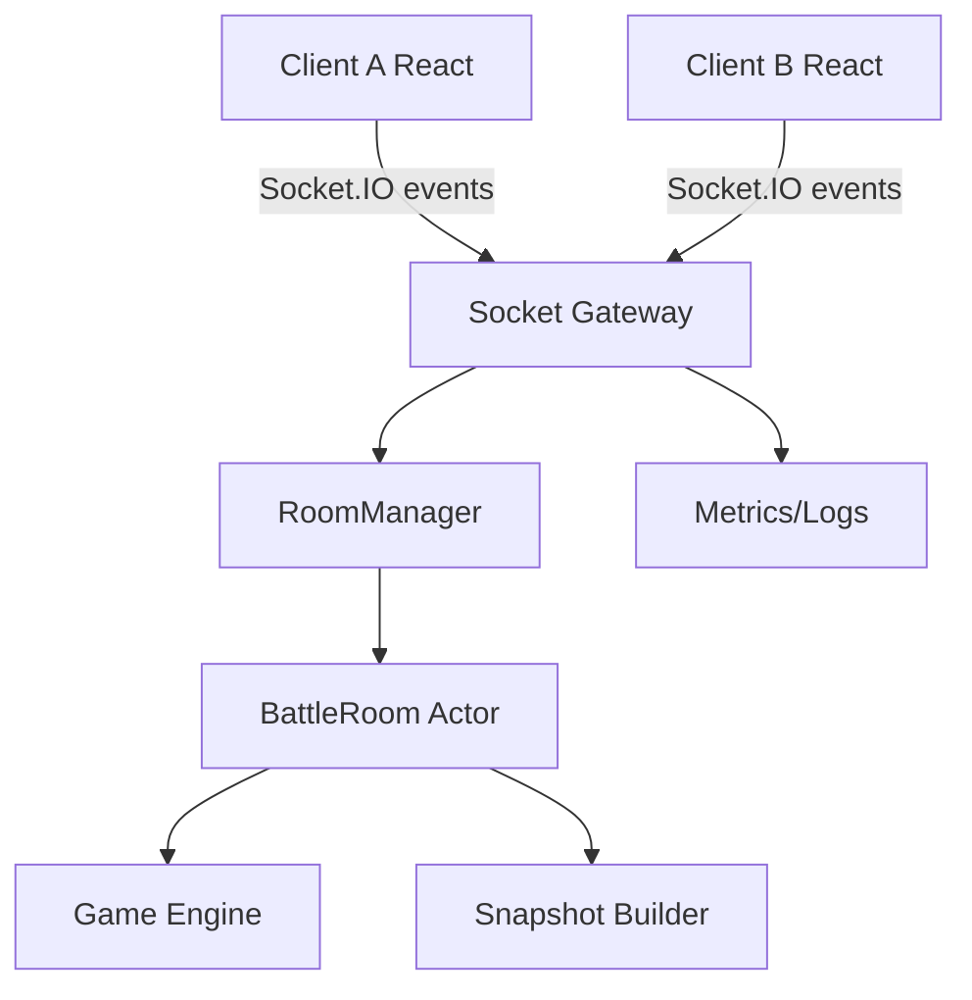
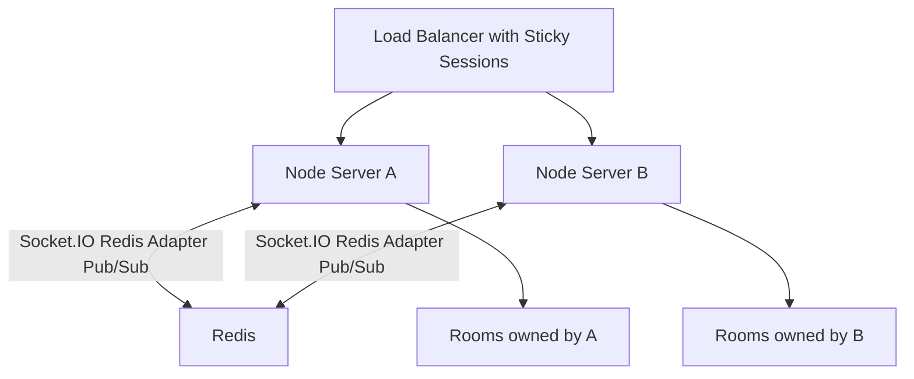
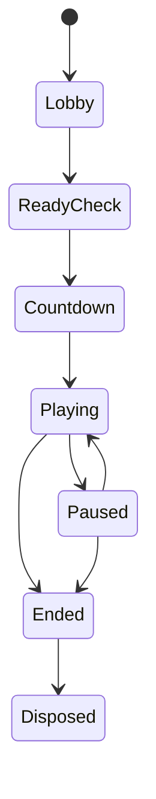

# 在线对战服务端架构、性能与扩展性设计

更新时间：2026-06-14

## 1. 文档目标

本文面向当前 React + Vite 本地双人格斗小游戏的在线对战服务端建设，重点回答：

- 服务端应该选什么框架。
- Socket.IO 服务如何组织代码。
- 房间、玩家、输入、战斗 tick、快照广播如何建模。
- 性能瓶颈在哪里，如何监控和优化。
- 单机、单机多进程、多机集群分别怎么扩。
- 代码设计模式如何落地，避免后续变成一团事件回调。

推荐最终方向：

```text
MVP：Node.js + Fastify/Express + Socket.IO + TypeScript
架构模式：Room Actor + Server-authoritative Game Loop + Protocol Adapter
扩展路线：单进程 -> 单机多进程 -> 多节点 + Redis Adapter + sticky sessions
长期方向：如果玩法持续复杂化，再评估 Colyseus 或独立 game-room service
```

## 2. 服务端职责边界

### 2.1 服务端必须负责

- 房间创建、加入、离开。
- 玩家 slot 分配：player 1 / player 2 / spectator。
- 房间状态同步：lobby、ready、playing、ended。
- 角色选择校验。
- 输入接收、限流、去重。
- 服务端权威战斗 tick。
- 快照广播。
- 胜负判定。
- 断线重连。
- 房间生命周期清理。
- 关键日志、指标、异常监控。

### 2.2 服务端不应该负责

- 粒子效果。
- 飘字动画。
- 震屏偏移。
- UI 动画。
- 客户端按键布局。
- 本地音效。

这些属于表现层，应该由客户端根据服务端事件本地生成。

### 2.3 权威边界

客户端只允许上报：

- 加入房间。
- 选择角色。
- ready。
- 当前输入。
- ping 或诊断信息。

客户端不允许上报：

- 自己的血量。
- 自己的坐标最终值。
- 命中结果。
- 伤害值。
- 胜负结果。
- 冷却是否结束。

所有战斗结果必须由服务端计算。

## 3. 框架选型

### 3.1 选型维度

| 维度 | 说明 |
| --- | --- |
| 实时通信能力 | 是否能稳定接入 Socket.IO 或 WebSocket |
| HTTP 性能 | 房间 API、健康检查、静态资源托管能力 |
| 工程复杂度 | MVP 上手成本和长期维护成本 |
| 类型安全 | TypeScript 事件协议和服务模块约束 |
| 扩展生态 | 中间件、日志、鉴权、监控、部署资料 |
| 多节点能力 | 是否方便接入 Redis Adapter、sticky sessions |

### 3.2 Express + Socket.IO

优点：

- 最成熟，资料最多。
- Socket.IO 官方示例大量使用 HTTP server + Express。
- 对当前项目最容易落地。
- 中间件生态丰富。

缺点：

- HTTP 层性能不是最强。
- 项目变大后需要自己约束分层。
- 类型约束和依赖注入需要自行设计。

适合：

- MVP。
- 小团队。
- 先做出在线对战闭环。

推荐程度：高。

### 3.3 Fastify + Socket.IO

优点：

- Fastify 官方定位是高性能、低开销 Node.js Web 框架。
- 官方 benchmark 页面持续维护性能对比。
- schema、plugin、hook 体系适合工程化。
- 比 Express 更适合作为长期 Node 服务底座。

缺点：

- Socket.IO 通常仍要绑定到底层 Node HTTP server。
- 团队如果不熟 Fastify，会多一点学习成本。

适合：

- 对 HTTP 性能、插件化、schema 校验有要求。
- 希望比 Express 更规整，但不想上 NestJS。

推荐程度：高。

### 3.4 NestJS + Socket.IO Gateway

优点：

- NestJS 官方支持 WebSocket Gateway。
- 依赖注入、模块、管道、守卫、拦截器都比较完整。
- 适合中大型服务端工程。
- 多人协作时结构更强。

缺点：

- 启动成本高。
- 对当前小游戏 MVP 可能偏重。
- 高频战斗 tick 和房间 actor 仍需要自己设计，Nest 不会替代游戏服务器。

适合：

- 项目未来会有账号、支付、排行榜、后台、运营系统。
- 团队已有 NestJS 经验。

推荐程度：中。

### 3.5 Hono / uWebSockets.js / 原生 ws

Hono：

- 非常轻量，适合边缘和 HTTP API。
- Socket.IO 接入不是它的核心优势。

uWebSockets.js：

- 性能很强。
- API 和生态与 Node 常规栈差异更大。
- Socket.IO 官方支持使用 `eiows` 等高性能底层实现，但工程复杂度会上升。

原生 `ws`：

- 更轻、更接近 WebSocket。
- 没有 Socket.IO 的 rooms、自动重连、fallback、ack、adapter 生态。

适合：

- 在线人数和性能压力非常高。
- 团队愿意为性能牺牲部分便利性。

当前不推荐作为第一版。

### 3.6 本项目推荐

第一版推荐：

```text
Fastify + Socket.IO
```

如果要最少折腾：

```text
Express + Socket.IO
```

我更倾向的落地顺序：

1. Express + Socket.IO 跑通 MVP。
2. 抽好业务分层，避免 Express 泄漏到业务核心。
3. 如果 HTTP API 增多或性能压力上来，再迁移 HTTP 外壳到 Fastify。

原因是当前真正关键瓶颈不在 HTTP 框架，而在：

- 房间模型。
- tick 调度。
- 快照大小。
- 输入频率。
- 多节点路由。
- 战斗逻辑能否稳定服务端运行。

## 4. 总体架构

### 4.1 单节点 MVP 架构



### 4.2 多节点架构



注意：

- Socket.IO 官方 Redis Adapter 使用 Redis Pub/Sub 转发不同服务器之间的包。
- Redis Adapter 不会把房间业务状态持久化进 Redis。
- 即使使用 Redis Adapter，官方文档仍然要求 sticky sessions，否则可能出现 HTTP 400。
- 多节点时要明确“房间业务状态在哪里”。最简单方式是一个房间只在一个进程里运行。

## 5. 模块划分

推荐目录：

```text
server
├─ index.ts
├─ app.ts
├─ config
│  └─ env.ts
├─ socket
│  ├─ createSocketServer.ts
│  ├─ socketHandlers.ts
│  └─ socketTypes.ts
├─ rooms
│  ├─ RoomManager.ts
│  ├─ BattleRoom.ts
│  ├─ RoomRegistry.ts
│  └─ RoomLifecycle.ts
├─ game
│  ├─ serverGameLoop.ts
│  ├─ serverGameState.ts
│  ├─ inputBuffer.ts
│  └─ snapshotBuilder.ts
├─ protocol
│  ├─ events.ts
│  ├─ validators.ts
│  └─ errors.ts
├─ infra
│  ├─ logger.ts
│  ├─ metrics.ts
│  ├─ redis.ts
│  └─ rateLimit.ts
└─ tests
   ├─ room.test.ts
   ├─ socket.integration.test.ts
   └─ load
      └─ socket-load.ts
```

共享协议建议放在：

```text
shared
└─ protocol.ts
```

让客户端和服务端共用类型。

## 6. 核心设计模式

### 6.1 Room Actor 模式

把每个对战房间看成一个 Actor：

- 房间拥有自己的状态。
- 房间拥有自己的 tick timer。
- 所有输入都发给房间。
- 房间串行处理输入和 tick。
- 外部不能直接修改房间内部状态。

好处：

- 避免多处代码同时修改 GameState。
- 房间生命周期清晰。
- 后续可以把房间迁移到独立进程或独立节点。

示例：

```ts
class BattleRoom {
  private state: ServerGameState;
  private inputs: InputBuffer;
  private status: RoomStatus;

  join(player: JoinCommand) {}
  selectCharacter(command: SelectCharacterCommand) {}
  setReady(command: ReadyCommand) {}
  pushInput(command: InputCommand) {}
  start() {}
  tick() {}
  dispose() {}
}
```

### 6.2 Command 模式

客户端事件不要直接操作状态，先转换成命令：

```ts
type RoomCommand =
  | { type: "join"; socketId: string; nickname: string }
  | { type: "selectCharacter"; socketId: string; characterId: string }
  | { type: "ready"; socketId: string; ready: boolean }
  | { type: "input"; socketId: string; input: PlayerInput }
  | { type: "disconnect"; socketId: string };
```

好处：

- 事件协议和业务逻辑解耦。
- 方便测试。
- 方便做回放或日志审计。

### 6.3 State Machine 模式

房间状态必须有明确状态机：



状态规则：

- `Lobby`：允许加入、选角色。
- `ReadyCheck`：双方已选角色，等待 ready。
- `Countdown`：倒计时，不再允许换角色。
- `Playing`：只接收输入。
- `Paused`：断线或异常暂停。
- `Ended`：胜负已定，等待清理或再来一局。
- `Disposed`：释放资源。

### 6.4 Adapter 模式

将 Socket.IO、HTTP 框架、Redis 与业务核心隔离。

```text
Socket.IO event
  -> SocketHandler
  -> Command
  -> RoomManager
  -> BattleRoom
```

这样未来从 Express 换 Fastify、从 Socket.IO 换 Colyseus 或 ws，不会重写全部业务。

### 6.5 Repository / Registry 模式

房间在内存里管理：

```ts
class RoomRegistry {
  private rooms = new Map<string, BattleRoom>();

  get(roomId: string) {}
  create(roomId: string) {}
  delete(roomId: string) {}
  list() {}
}
```

MVP 不需要数据库持久化房间。

后续如果要战绩和排行榜，另建：

```text
MatchRepository
LeaderboardRepository
PlayerRepository
```

### 6.6 Snapshot Builder 模式

不要直接把完整 GameState 发给客户端。用 builder 输出最小可公开状态：

```ts
class SnapshotBuilder {
  build(state: ServerGameState): GameSnapshot {
    return {
      frame: state.frame,
      serverTime: Date.now(),
      p1: this.fighter(state.p1),
      p2: this.fighter(state.p2),
      projectiles: state.projectiles.map(this.projectile),
      winner: state.winner,
    };
  }
}
```

好处：

- 减少带宽。
- 避免泄漏内部状态。
- 方便版本兼容。

## 7. 性能模块设计

### 7.1 性能目标

MVP 目标：

| 指标 | 目标 |
| --- | --- |
| 单房间人数 | 2 |
| 单房间 spectator | 第一版不支持 |
| 服务端 tick | 60Hz |
| 快照广播 | 20Hz |
| 输入上报 | 30Hz + 关键按键立即发送 |
| 单房间服务端 CPU | 尽量小于 1% 单核 |
| tick drift | P95 小于 8ms |
| event loop lag | P95 小于 20ms |
| 断线重连窗口 | 30s |

### 7.2 主要瓶颈

1. JSON 序列化和反序列化。
2. 高频 socket 事件。
3. 每个房间独立 `setInterval` 数量过多。
4. GameState 对象过大。
5. 同步了不该同步的粒子和 UI 状态。
6. 跨节点广播。
7. Redis Pub/Sub 放大。
8. GC 抖动。
9. 负载均衡没有 sticky sessions。

### 7.3 Tick 调度策略

第一版可以每个房间一个 timer：

```ts
room.tickTimer = setInterval(() => room.tick(), 1000 / 60);
```

房间数量少时简单可靠。

当房间数变多，建议改成全局 scheduler：

```ts
class GameScheduler {
  private rooms = new Set<BattleRoom>();

  start() {
    setInterval(() => {
      const now = performance.now();
      for (const room of this.rooms) {
        room.tick(now);
      }
    }, 1000 / 60);
  }
}
```

对比：

| 方案 | 优点 | 缺点 |
| --- | --- | --- |
| 每房间 timer | 简单、独立 | 大量房间 timer 开销大 |
| 全局 scheduler | 更可控、易统计 | 单个慢房间可能拖累循环 |
| 分片 scheduler | 可扩展 | 实现复杂 |

推荐：

- 0 到 100 房间：每房间 timer 可接受。
- 100 房间以上：全局 scheduler。
- 更高并发：按房间 shard 到 worker 或节点。

### 7.4 快照频率控制

逻辑 tick 和广播频率分离：

```text
逻辑 tick：60Hz
快照广播：20Hz
渲染：客户端 60Hz
```

原因：

- 伤害和碰撞需要高频。
- 网络广播没必要每帧发。
- 客户端可以插值。

广播策略：

```ts
if (frame % 3 === 0) {
  io.to(roomId).volatile.emit("battle:snapshot", snapshot);
}
```

使用 `volatile` 的原因：

- 快照是实时数据，旧快照过期价值低。
- 网络拥塞时丢旧快照比堆积延迟更好。

### 7.5 输入处理性能

客户端不要每个 keydown 都疯狂 emit。

推荐：

- 每 33ms 发送一次当前输入状态。
- 技能按键变化立即发送一次。
- 服务端只保存每个玩家最新输入。
- 不堆无限输入队列。

输入缓冲：

```ts
class InputBuffer {
  private latest = new Map<PlayerSlot, PlayerInput>();
  private lastSeq = new Map<PlayerSlot, number>();

  push(slot: PlayerSlot, input: PlayerInput) {
    if (input.seq <= (this.lastSeq.get(slot) ?? -1)) return;
    this.lastSeq.set(slot, input.seq);
    this.latest.set(slot, input);
  }

  get(slot: PlayerSlot) {
    return this.latest.get(slot) ?? null;
  }
}
```

### 7.6 网络包大小控制

不要发送：

- 完整角色对象。
- 技能描述。
- taunts。
- 粒子数组。
- damageTexts。
- screenShake 内部状态。

只发送：

- `characterId`。
- 坐标。
- HP/MP。
- 动作状态。
- 投射物必要字段。
- 事件。

可以从对象改为短字段：

```ts
// 可读版本
{ x: 120, y: 450, hp: 80, mp: 50 }

// 极限优化版本
[120, 450, 80, 50]
```

MVP 先用可读对象，压测后再优化。

### 7.7 对象分配和 GC

高频 tick 中尽量减少临时对象：

- 复用数组。
- 控制 projectiles 数量。
- 删除过期实体时避免频繁创建大对象。
- 快照 builder 做字段拷贝，但不要深拷贝整棵状态。
- 粒子留在客户端，不进服务端状态。

### 7.8 压缩策略

Socket.IO 的 `perMessageDeflate` 默认关闭。官方性能文档提醒压缩会带来性能和内存开销。

建议：

- MVP 保持关闭。
- 如果公网带宽成瓶颈，再用压测评估是否开启。
- 高频小包通常不适合强压缩。

## 8. 性能监控指标

### 8.1 业务指标

- 当前在线 socket 数。
- 当前房间数。
- playing 房间数。
- lobby 房间数。
- 每秒输入消息数。
- 每秒 snapshot 数。
- 每秒断线数。
- 每秒重连成功数。
- 平均房间生命周期。
- 房间异常结束数。

### 8.2 游戏指标

- tick 执行耗时。
- tick drift。
- snapshot 构建耗时。
- 单房间 projectiles 数量。
- 单房间事件数。
- 每个玩家输入 seq 间隔。
- 玩家 RTT。

### 8.3 Node 运行时指标

- event loop lag。
- heap used。
- RSS。
- CPU 使用率。
- GC pause。
- active handles。
- socket 连接数。

### 8.4 推荐埋点

```ts
metrics.gauge("rooms.active", registry.size());
metrics.gauge("rooms.playing", registry.countByStatus("playing"));
metrics.histogram("room.tick.duration_ms", tickDuration);
metrics.histogram("room.snapshot.size_bytes", byteLength);
metrics.counter("socket.input.received");
metrics.counter("socket.input.dropped");
metrics.counter("room.disconnected");
metrics.counter("room.reconnected");
```

## 9. 扩展性设计

### 9.1 阶段 1：单进程

适合：

- MVP。
- 内测。
- 同时几十个房间。

架构：

```text
1 Node.js process
  - HTTP server
  - Socket.IO
  - RoomRegistry in memory
```

优点：

- 简单。
- 状态都在本进程。
- 最容易排查。

缺点：

- 只能使用单核主要计算能力。
- 进程崩溃丢失所有房间。

### 9.2 阶段 2：单机多进程

使用 Node cluster 或 PM2 cluster。

Node 官方 cluster 模块会 fork worker 进程，worker 可以共享 server port，由主进程分发连接。

挑战：

- Socket.IO 需要 sticky sessions。
- 房间不能跨 worker 随便迁移。
- 默认内存 Adapter 只能在单个进程内广播。

推荐策略：

- 如果只是利用多核，优先使用负载均衡 sticky sessions。
- 每个房间只存在于一个 worker。
- 不做跨 worker 房间迁移。
- 如需跨 worker 广播，接 Socket.IO cluster adapter 或 Redis adapter。

### 9.3 阶段 3：多节点 + Redis Adapter

Socket.IO 官方说明，多服务器扩展时需要把默认内存 Adapter 换成其他 Adapter，确保事件能路由到正确客户端。

Redis Adapter 作用：

- 在多个 Socket.IO server 之间转发广播包。
- 支持向跨节点 room 广播。

Redis Adapter 不负责：

- 保存业务房间状态。
- 保存 GameState。
- 持久化消息。
- 解决 sticky sessions。

部署：

```text
Load Balancer
  -> Node A
  -> Node B
  -> Node C
Redis Pub/Sub for Socket.IO adapter
```

必须注意：

- 开启 sticky sessions。
- 房间权威状态仍要归属到某个节点。
- 如果一个 room 的两个玩家被分到不同节点，Redis Adapter 可以广播消息，但 GameState 权威运行在哪里仍要明确。

### 9.4 阶段 4：房间分片服务

更长期的架构：

```text
Gateway Service
  -> Room Directory
  -> Game Room Worker A
  -> Game Room Worker B
  -> Redis/Postgres for metadata
```

职责：

- Gateway 只处理连接和鉴权。
- Room Directory 记录 roomId 属于哪个 worker。
- Game Room Worker 运行战斗 tick。
- 玩家连接路由到对应 worker。

这种架构更复杂，但能支撑更大规模。

### 9.5 横向扩容优先级

建议扩容顺序：

1. 减少包大小。
2. 降低 snapshot 频率。
3. 去掉服务端粒子和 UI 状态。
4. 单进程优化 tick。
5. 单机多进程。
6. Redis Adapter + sticky sessions。
7. 房间分片。
8. 独立 game-room worker 集群。

## 10. 数据存储设计

### 10.1 MVP 不需要持久化

以下数据放内存即可：

- 房间。
- 玩家连接。
- 当前对局 GameState。
- 输入缓冲。
- reconnectToken。

原因：

- 房间生命周期短。
- 实时对战状态高频变化，不适合每帧落库。

### 10.2 需要持久化的数据

后续可以存：

- 对局结果。
- 战绩。
- 排行榜。
- 玩家昵称。
- 分享记录。
- 异常日志。

推荐：

- PostgreSQL：战绩、排行榜、用户。
- Redis：短期房间 metadata、限流、分布式锁、排行榜缓存。
- 对象存储：回放文件，如果未来做回放。

### 10.3 不建议存数据库的数据

- 每帧 GameState。
- 每帧输入。
- 粒子。
- 飘字。

如果要回放，存输入日志比存每帧状态更好：

```text
seed + characterIds + input timeline = replay
```

前提是战斗逻辑确定性足够高。

## 11. 服务端代码设计

### 11.1 事件处理层

只做：

- 参数校验。
- 鉴权。
- socketId 绑定。
- 转成 command。
- 调用 RoomManager。
- 返回 ack。

不要在 handler 里写战斗逻辑。

```ts
socket.on("player:ready", (payload, ack) => {
  const result = roomManager.dispatch({
    type: "ready",
    socketId: socket.id,
    roomId: payload.roomId,
    ready: payload.ready,
  });

  ack(result);
});
```

### 11.2 RoomManager

职责：

- 创建 roomId。
- 查找房间。
- 路由 command 到 BattleRoom。
- 清理空房间。
- 查询房间统计。

```ts
class RoomManager {
  createRoom(socketId: string): CreateRoomResult {}
  joinRoom(command: JoinCommand): JoinRoomResult {}
  dispatch(command: RoomCommand): CommandResult {}
  cleanup() {}
}
```

### 11.3 BattleRoom

职责：

- 持有房间状态。
- 持有 GameState。
- 分配 slot。
- 处理 ready。
- 处理输入。
- 运行 tick。
- 生成快照。
- 广播事件。
- dispose。

不要让 BattleRoom 依赖 React、DOM、浏览器 API。

### 11.4 Game Engine

目标是纯函数或接近纯函数：

```ts
tickGame(state, inputs, deltaFrames): TickResult
```

需要逐步移除：

- `setTimeout`。
- 浏览器 API。
- 不可控 `Math.random()`。
- UI 直接副作用。

### 11.5 Protocol Validator

推荐使用 `zod` 或 JSON Schema 校验外部输入。

```ts
const PlayerInputSchema = z.object({
  seq: z.number().int().nonnegative(),
  clientTime: z.number(),
  left: z.boolean(),
  right: z.boolean(),
  jump: z.boolean(),
  attack: z.boolean(),
  skill1: z.boolean(),
  skill2: z.boolean(),
  ultimate: z.boolean(),
});
```

服务端绝不信任客户端发来的 payload。

## 12. 高可用与容错

### 12.1 进程异常

策略：

- 使用 PM2、Docker restart policy 或平台自动重启。
- 崩溃后内存房间会丢失。
- MVP 可接受，正式版需要玩家看到“房间异常，请重新创建”。

### 12.2 房间异常

Room tick 内部必须 try/catch：

```ts
try {
  room.tick();
} catch (error) {
  logger.error(error);
  room.fail("ROOM_INTERNAL_ERROR");
}
```

异常时：

- 停止 timer。
- 通知客户端。
- 清理房间。
- 记录日志。

### 12.3 消息风暴

防护：

- 输入事件限流。
- 单 socket 每秒事件数限制。
- 单 IP 连接数限制。
- roomId 加入频率限制。
- payload 大小限制。

### 12.4 断线

推荐：

- 玩家断线后房间进入 `Paused`。
- 30 秒内允许 reconnectToken 恢复。
- 超时判负或关闭房间。

### 12.5 邀请链接与重连身份隔离

当前实现中，重连身份必须和邀请加入身份分开处理，否则同一台机器上开两个浏览器时容易出现“邀请方拿到房主 slot”的问题。

前端规则：

- 房主创建房间后，地址栏写入 `?room=<roomId>`。
- 复制给对方的邀请链接写入 `?room=<roomId>&join=1`。
- `reconnectToken` 存入 `sessionStorage`，不使用 `localStorage`。
- 当 URL 带 `join=1` 时，前端按新玩家加入，不读取当前会话里的 `reconnectToken`。
- 当 URL 不带 `join=1` 且当前会话存在 token 时，才尝试恢复原 slot。

服务端规则：

- `reconnectToken` 只用于恢复同一个玩家的离线 slot。
- 如果 token 对应的玩家仍然 `connected=true`，且当前 socketId 不同，服务端不得覆盖原 socket。
- 加入房间时，如果无法重连，应走普通 slot 分配逻辑；没有空 slot 时返回 `ROOM_FULL`。
- 断线重连成功后应重新 `socket.join(roomId)`，更新 `socket.data.roomId`、`socket.data.slot` 和 `socket.data.reconnectToken`。

这条规则比单纯依赖 Socket.IO connection recovery 更重要，因为它明确约束了业务身份归属。

## 13. 部署方案

### 13.1 MVP 部署

```text
Node.js server
  - Express/Fastify HTTP
  - Socket.IO
  - serve dist
```

单服务同域：

```text
https://game.example.com
https://game.example.com/socket.io/
```

优点：

- CORS 简单。
- 分享链接简单。
- 部署简单。

### 13.2 生产部署

推荐：

```text
Nginx / Cloud Load Balancer
  -> Node.js app
  -> Redis optional
  -> Postgres optional
```

Nginx 要支持 WebSocket upgrade：

```nginx
proxy_http_version 1.1;
proxy_set_header Upgrade $http_upgrade;
proxy_set_header Connection "upgrade";
```

### 13.3 环境变量

```text
NODE_ENV=production
PORT=3001
CLIENT_ORIGIN=https://game.example.com
SOCKET_CORS_ORIGIN=https://game.example.com
ROOM_MAX_PLAYERS=2
ROOM_RECONNECT_TIMEOUT_MS=30000
GAME_TICK_RATE=60
SNAPSHOT_RATE=20
REDIS_URL=redis://localhost:6379
```

## 14. 压测方案

### 14.1 压测目标

先测三组：

```text
10 rooms / 20 clients
50 rooms / 100 clients
100 rooms / 200 clients
```

指标：

- CPU。
- 内存。
- event loop lag。
- tick duration。
- snapshot delay。
- socket disconnect rate。
- p95 RTT。

### 14.2 压测脚本思路

使用 `socket.io-client` 模拟玩家：

```ts
for (let i = 0; i < rooms; i++) {
  const a = io(url);
  const b = io(url);
  // create room
  // join room
  // select characters
  // ready
  // send random input at 30Hz
}
```

输入生成：

- 随机左右移动。
- 随机跳跃。
- 随机普通攻击。
- 每 1 到 3 秒随机技能。

### 14.3 验收门槛

MVP 可接受：

- 50 房间稳定 10 分钟。
- 无异常内存增长。
- p95 tick duration 小于 5ms。
- p95 event loop lag 小于 20ms。
- 客户端断线率低于 1%。

## 15. 阶段落地计划

### 阶段 1：服务端骨架

交付：

- HTTP server。
- Socket.IO server。
- room create/join/leave。
- RoomManager。
- BattleRoom 空壳。
- 结构化日志。

验收：

- 两个浏览器能进入同一房间。
- room state 能广播。

### 阶段 2：大厅状态

交付：

- slot 分配。
- 角色选择。
- ready。
- reconnectToken。
- 房间状态机。

验收：

- 双方选角色和 ready 状态互相可见。
- 断线 30 秒内可恢复 slot。

### 阶段 3：战斗服务端权威

交付：

- 标准输入协议。
- 服务端 GameState。
- 服务端 tick。
- snapshot builder。
- battle:start / battle:snapshot / battle:game-over。

验收：

- 双浏览器在线移动、攻击、扣血、胜负一致。

### 阶段 4：性能模块

交付：

- tick duration 指标。
- snapshot size 指标。
- input drop 统计。
- room count 统计。
- 简单压测脚本。

验收：

- 50 房间压测稳定。
- 性能数据可观测。

### 阶段 5：扩展性准备

交付：

- 可选 Redis Adapter 配置。
- sticky session 部署说明。
- graceful shutdown。
- room cleanup。
- 限流。

验收：

- 单机多进程或多节点方案有明确开关。
- 服务停止时能拒绝新房间并清理旧连接。

## 16. 技术决策记录

### 16.1 为什么不用数据库同步战斗状态

实时格斗状态变化频率高，数据库同步会带来延迟、成本和一致性问题。对战状态应放在内存，由房间 actor 权威维护。

### 16.2 为什么不一开始做多节点

多节点最大问题不是 Socket.IO 广播，而是 GameState 权威归属和房间路由。MVP 应先单节点跑通玩法和协议，再扩。

### 16.3 为什么服务端权威

客户端互相同步状态很容易分叉，也容易作弊。服务端权威更适合格斗游戏，即使第一版手感稍慢，也能保证结果一致。

### 16.4 为什么不把粒子放服务端

粒子是表现层，数据量大、随机性强、对胜负无影响。服务端只发事件，客户端自行表现。

## 17. 推荐最终架构

第一版：

```text
Express + Socket.IO + TypeScript
Room Actor
In-memory RoomRegistry
Server-authoritative GameState
60Hz server tick
20Hz volatile snapshot
30Hz client input
sessionStorage reconnectToken
invite URL with ?join=1
single-node deploy
```

第二版：

```text
Fastify or Express
metrics + load test
global scheduler
input rate limit
snapshot size optimization
graceful shutdown
```

第三版：

```text
Redis Adapter
sticky sessions
room sharding
Postgres for match result
Redis for metadata/rate limit
```

如果游戏继续扩大，最终可以演进到：

```text
Gateway Service
Room Directory
Game Room Worker Pool
Redis/Postgres
Observability Stack
```

## 18. 参考资料

- Socket.IO Introduction: https://socket.io/docs/v4/
- Socket.IO Adapter: https://socket.io/docs/v4/adapter/
- Socket.IO Redis Adapter: https://socket.io/docs/v4/redis-adapter/
- Socket.IO Performance Tuning: https://socket.io/docs/v4/performance-tuning/
- Socket.IO Memory Usage: https://socket.io/docs/v4/memory-usage/
- Node.js Cluster: https://nodejs.org/api/cluster.html
- Fastify: https://fastify.io/
- Fastify Benchmarks: https://fastify.io/benchmarks/
- NestJS WebSocket Gateways: https://docs.nestjs.com/websockets/gateways
- NestJS Performance with Fastify: https://docs.nestjs.com/techniques/performance
